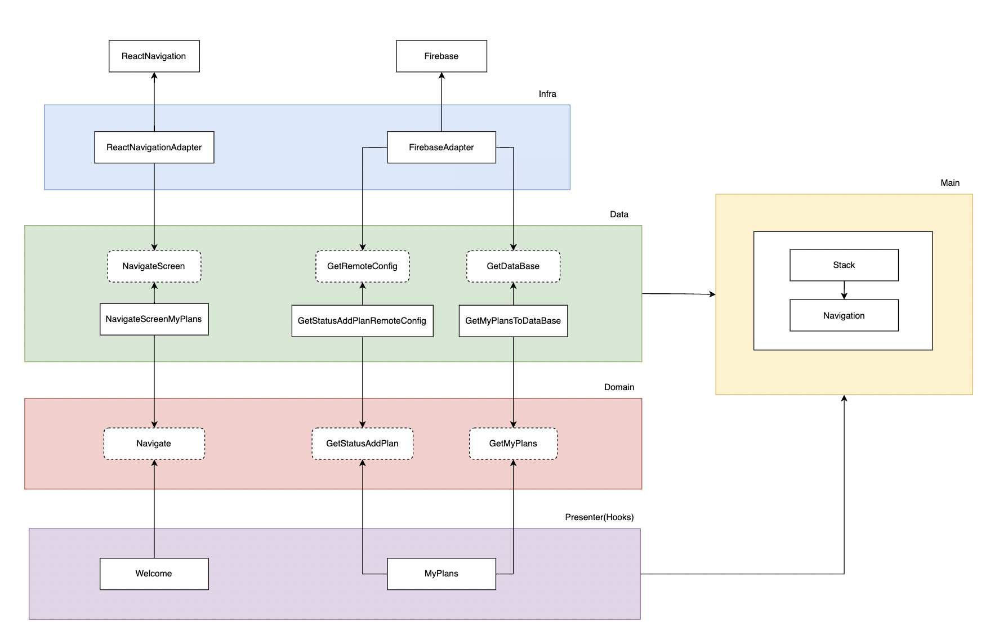
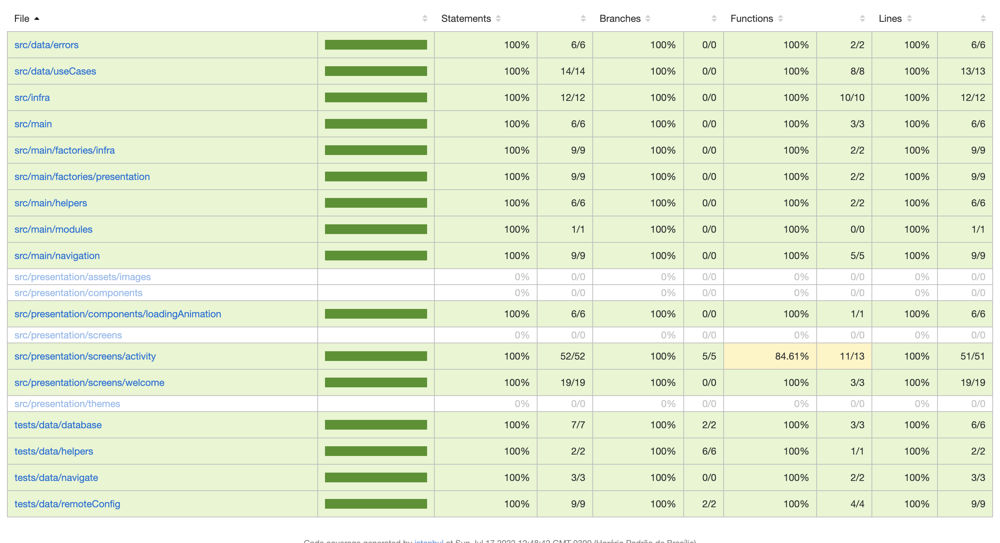
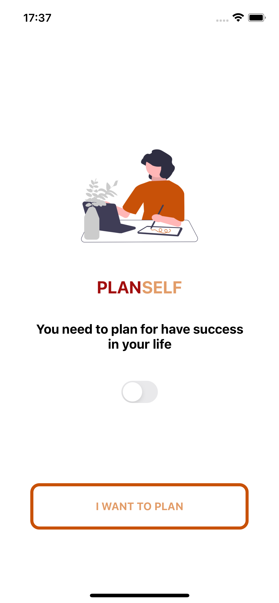
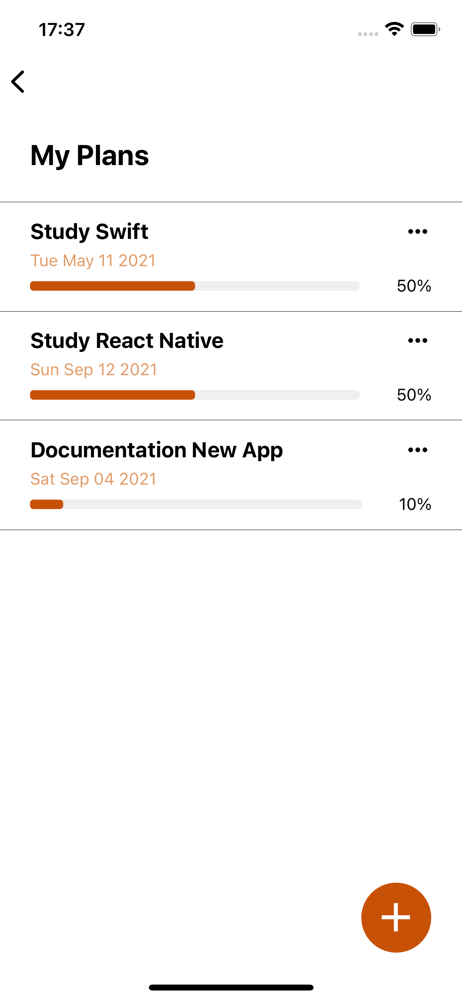

# PlanSelfApp

## This application was developed with the focus of putting into practice the methodology of TDD (Test Driven Development), Clean Architecture and Architecture Pattern MVP (Model View Presenter) looking a little at the decoupling of React Navigation, in addition to using some integrations with the Firebase.

If you want more details about the methodologies used, you can find it in this [repository](https://github.com/MarlonBeloMarques/animeApp-tdd-cleanArch).

### A little more about the project

As already mentioned, the objective of this project is to continue in the process of using good development and architecture practices. In the beginning, the focus of this project, in addition to the already mentioned, was to consume Firebase services following the concepts of Clean Architecture. However, during development he decides to try something else that brought an article to life (How to decouple Navigation in React Native). Here is the result of that project.

### About architecture

This was the Architecture diagram built to follow as a basis for development:



### About the Tests

To write the tests, **jest** and **react-native-testing-library** were used.



### About the Project

PlanSelf is an application for you to manage your goals, adding progress, start date, etc.

<p align="flex-start">
  
  
</p>

### Build

Now the grand finale, in the root of the project, run:

```bash
yarn
```

So depending on the platform you want to run the project on, just run:

```bash
yarn android
```

```bash
yarn ios
```

### Contact

To contact me, you can use:
- Instagram: [@marlonbelomarques](https://www.instagram.com/marlonbelomarques)
- Linkedin: [Marlon Marques](https://www.linkedin.com/in/marlon-marques-0b509813b/)
- Twitter: [@marlo_marq](https://twitter.com/marlo_marq)
